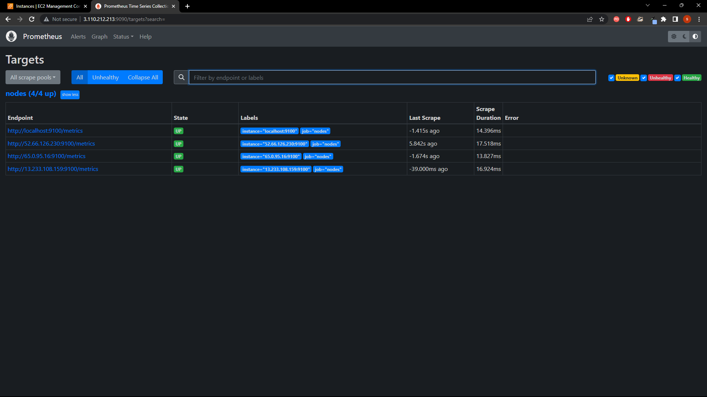

## Configuring Ansible Hosts:

Before we proceed with the Ansible playbook, we need to configure the hosts for Ansible. As Ansible is installed on the master node, we will provide the SSH key for the slave nodes and add the slave nodes to the Ansible hosts file.

```ini
[servers]
server1 ansible_host=<server_1_ip>
server2 ansible_host=<server_2_ip>
server3 ansible_host=<server_3_ip>
```

## Wirting ansible playbook for Node exporter in the slave nodes
Next, we will create an Ansible playbook named [pplaybook](../ansible/playbook.yml) to download and set up Node Exporter on the slave nodes automatically. The playbook is configured below:

```yml
---
- name: Installing Node Exporters in Slave Nodes 
  hosts: all
  become: true
  vars:
    node_exporter_version: 1.6.1
    
  tasks:
    - name: download node exporter
      get_url:
        url: https://github.com/prometheus/node_exporter/releases/download/v{{ node_exporter_version }}/node_exporter-{{ node_exporter_version }}.linux-amd64.tar.gz
        dest: /tmp
    - name: Unziping Node Exporter 
      unarchive:
        remote_src: yes
        src: /tmp/node_exporter-{{ node_exporter_version }}.linux-amd64.tar.gz
        dest: /tmp
    - name: move node exporter to /usr/local/bin
      copy:
        src: /tmp/node_exporter-{{ node_exporter_version }}.linux-amd64/node_exporter
        dest: /usr/local/bin/node_exporter
        remote_src: yes
        owner: root
        group: root
        mode: 0755
    - name: Setting up unit file for systemd 
      template:
        src: templates/node_exporter.service.ini
        dest: /etc/systemd/system/node_exporter.service
        owner: root
        group: root
        mode: 0600
    - name: Configuring Systemd to use service 
      systemd:
        daemon_reload: yes
        enabled: yes
        state: started
        name: node_exporter.service
```

This playbook will download the specified version of Node Exporter and set up a service file for automatic start-up. Make sure to create a template named [node_exporter.service.ini](../ansible/templates/node_exporter.service.ini) in the templates directory to configure the service properly.

With this Ansible playbook, you can easily deploy Node Exporter on the slave nodes, and the service will start automatically on each node

## Configuring Prometheus 

To configure Prometheus to listen to all the Node Exporter instances, we need to edit the [prometheus.yml](../prometheus/prometheus.yml) file. This file contains the global configurations and scrape configurations for various jobs.

Modify the scrape_configs section to include the targets of all the Node Exporter instances:

```yaml
# my global config
global:
  scrape_interval: 15s # Set the scrape interval to every 15 seconds. Default is every 1 minute.

scrape_configs:
  - job_name: "nodes"

    static_configs:
      - targets: ["<master-node-ip>:9100","<slave-node-1-ip>:9100","<slave-node-2-ip>:9100","<slave-node-3-ip>:9100"]
```

To apply the new configuration, restart the Prometheus service:


```bash 
sudo systemctl status prometheus.service
```

After making the necessary configurations and changes to Prometheus, visiting the Prometheus dashboard will now display all the nodes in action. The dashboard will showcase the real-time metrics collected from each Node Exporter instance. This provides a comprehensive view of the performance and status of all the monitored nodes. With the scrape interval set to 15 seconds, the dashboard will continuously update, providing up-to-date insights into the health and resource utilization of the nodes. 



## Setting up the Data Source in Grafana
To integrate Prometheus with Grafana and use it as a data source, follow these steps:

- Click on the Grafana logo to open the sidebar.
- In the sidebar, locate and click on "Data Sources."
- Choose "Add New" to add a new data source.
- Select "Prometheus" as the data source type from the available options.
- Set the Prometheus server URL. In our case, the URL will be "http://localhost:9090/" (assuming Prometheus is running on the master node).
- Click on "Add" to test the connection and save the new data source.

By completing these steps, Grafana will be successfully connected to Prometheus, and can now utilize Prometheus data in Grafana dashboards. The integration enables us to visualize and analyze the metrics collected by Prometheus, providing you with a powerful monitoring and visualization platform for  infrastructure and applications.

## Creating a Dashboard in Grafana
To create a new dashboard in Grafana and visualize the data from Prometheus, follow these steps:

- Click on the Grafana logo to open the sidebar.
- In the sidebar, locate and click on "Dashboards" to access the dashboard section.
- Click on "Manage" in the dashboard section to open the dashboard management page.
- On the dashboard management page, click on "Create" in the top-right corner to star creating a new dashboard.
- Once the new dashboard is created, click on "Add new panel" to add visualization panels to the dashboard.
- Customize the panel options as needed, including the title, legend, and axis labels, to tailor the visualiztion to your requirements.
- Adjust additional settings such as the dashboard title, time range, refresh interval, etc., to fine-tune the dashboard according to your preferences.
- Once the dashboard design is complete, click on "Save" in the top-right corner to save your changes and finalize the dashboard.
- To return to the Grafana home page, click the "Home" icon in the sidebar.
- Access your newly created dashboard under "Dashboards" in the sidebar.
- Click on the dashboard to view it and analyze the data sourced from Prometheus.

By following these steps, we will have successfully created a dashboard in Grafana and integrated it with Prometheus. The dashboard allows us to visualize and analyze the data collected by Prometheus in a visually appealing and informative manner, providing valuable insights into the health and performance of your system and applications.